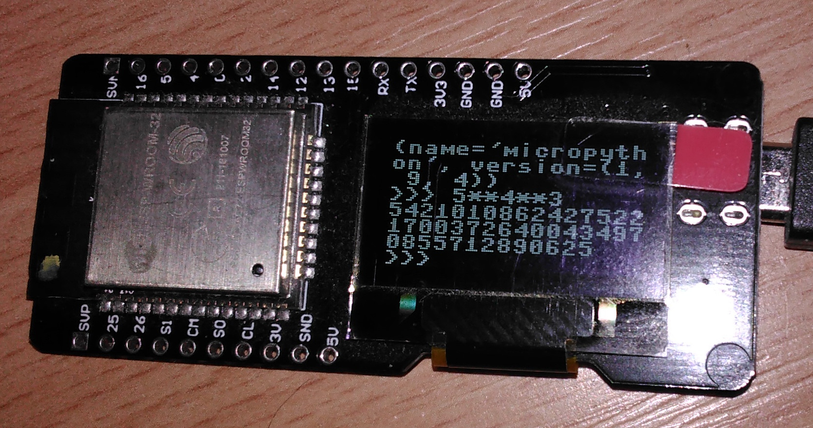

fork-mission-statement
======================
This fork is terminated, boochow now has dedicated repo for FBConsole:
[https://github.com/boochow/FBConsole](https://github.com/boochow/FBConsole)


This fork is only intended to make [raspberrypi/modules/FBConsole.py](raspberrypi/modules/FBConsole.py) usable (again) for ESP MicroPython with SSD1306 Oled. Main usecase is MicroPython REPL redirection to Oled:

    import machine, ssd1306
    i2c = machine.I2C(scl=machine.Pin(4), sda=machine.Pin(5))
    oled = ssd1306.SSD1306_I2C(128, 64, i2c)
    
    from FBConsole import FBConsole
    console = FBConsole(oled)
    os.dupterm(console)

<br>

# micropython-raspberrypi

MicroPython on bare metal Raspberry Pi Zero / Zero W

## How to build
```
git clone https://github.com/boochow/micropython-raspberrypi.git
cd micropython-raspberrypi
git submodule update --init
cd micropython; git submodule update --init; cd ..
cd raspberrypi; make
```

## Options
1. `MICROPY_HW_USBHOST=1` to enable USB keyboard support.
1. `MICROPY_MOUNT_SD_CARD=1` to mount SD card on /sd in the boot sequence.

## How to install

1. download `bootcode.bin` and `start.elf` from https://github.com/raspberrypi/firmware/tree/master/boot
1. copy `bootcode.bin` and `start.elf` to the root of your microSD card
1. copy `build/firmware.img` to the root of your microSD card
1. copy build/config.txt to the root of your microSD card. (if `config.txt` already exists, edit it to add a line `kernel=firmware.img`.)

## Modules and Classes

See [wiki](https://github.com/boochow/micropython-raspberrypi/wiki).

## References

The First bare metal Raspberry Pi port by Stefan Naumann. ([Bare\-Metal Raspberry Pi port by naums · Pull Request \#3522 · micropython/micropython](https://github.com/micropython/micropython/pull/3522))

csud USB host driver by Alex Chadwick. ([Chadderz121/csud: Chadderz's Simple USB Driver for Raspberry Pi](https://github.com/Chadderz121/csud) I modified this to support RPi zero/zero W. The modified version is [here](https://github.com/boochow/csud)).

sd.c SD card driver by Zoltan Baldaszti. ([raspi3\-tutorial/0B\_readsector at master · bztsrc/raspi3\-tutorial](https://github.com/bztsrc/raspi3-tutorial/tree/master/0B_readsector))

A lot of bare metal examples by David Welch. ([dwelch67/raspberrypi: Raspberry Pi ARM based bare metal examples](https://github.com/dwelch67/raspberrypi))
